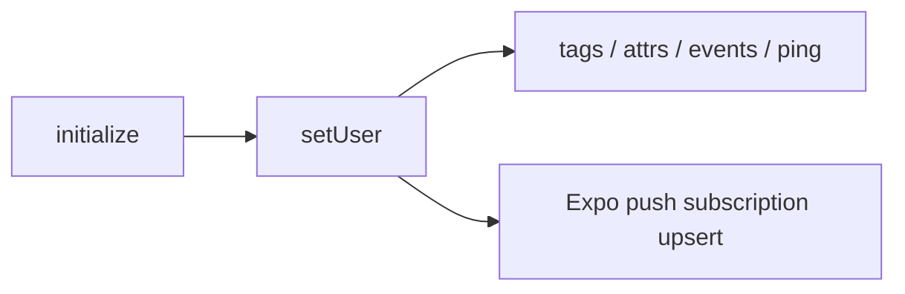

# Getting started

This guide describes how `@motisig/expo-motisig-sdk` fits into your Expo / React Native app at runtime. For install steps, see the [README](../README.md). For keys and URLs, see [CONFIGURATION.md](CONFIGURATION.md).

## Overview

1. Construct a singleton `MotiSig` somewhere global to your app (a module-level constant or a React context).
2. Call `await motisig.initialize(...)` once, typically in your top-level `App.tsx` `useEffect`.
3. Call `await motisig.setUser('user-id')` after sign-in. This registers the user (POST `/users`, 409-tolerant) and uploads the Expo push token when available.
4. Subscribe to events with `motisig.addListener(...)` to react to foreground notifications and taps.
5. Use the rest of the API (`addTags`, `triggerEvent`, etc.) for tagging, attributes, events, and click tracking.

## Lifecycle



After `initialize`:

- The SDK requests notification permission unless `skipPermissionRequest: true`.
- It attaches `expo-notifications` listeners (`addPushTokenListener`, `addNotificationReceivedListener`, `addNotificationResponseReceivedListener`) unless `skipNotificationListeners: true`.
- It reads any pending cold-start notification response (`getLastNotificationResponseAsync`) so your `notification_response` listener fires once your app starts.
- It subscribes to `AppState` changes to drive a foreground heartbeat `ping` (default every 60 s) and to patch the push subscription `permission` field when the user comes back from Settings.

## Foreground banners (recommended)

Without `Notifications.setNotificationHandler`, iOS may suppress the banner while your app is open. Call once at startup (e.g. at the top of `App.tsx`):

```ts
import * as Notifications from 'expo-notifications';

Notifications.setNotificationHandler({
  handleNotification: async () => ({
    shouldShowBanner: true,
    shouldShowList: true,
    shouldPlaySound: true,
    shouldSetBadge: false,
  }),
});
```

## Ordered mutations

User-scoped HTTP mutations (`setUser`, tags, attributes, `updateUser`, `ping`, `triggerEvent`, push subscription upsert/patch/remove) run on an internal `AsyncQueue`. Each promise resolves in the order it was enqueued, even if the underlying HTTP requests would otherwise race. See [USER_PROFILE.md](USER_PROFILE.md) for `logout` semantics.

## Initialization

```ts
import { MotiSig } from '@motisig/expo-motisig-sdk';
import * as Notifications from 'expo-notifications';

Notifications.setNotificationHandler({
  handleNotification: async () => ({
    shouldShowBanner: true,
    shouldShowList: true,
    shouldPlaySound: true,
    shouldSetBadge: false,
  }),
});

const motisig = new MotiSig();

useEffect(() => {
  void motisig.initialize({
    sdkKey: process.env.EXPO_PUBLIC_MOTISIG_SDK_KEY!,
    projectId: process.env.EXPO_PUBLIC_MOTISIG_PROJECT_ID!,
    // baseURL: 'https://api.motisig.ai/client',
    // easProjectId: 'uuid',
  });
}, []);
```

## Next steps

- [CONFIGURATION.md](CONFIGURATION.md) — keys, base URL, EAS project id, ping interval, env vars
- [USER_PROFILE.md](USER_PROFILE.md) — `setUser`, `updateUser`, `logout`, `reset`
- [EVENTS_TAGS_ATTRIBUTES.md](EVENTS_TAGS_ATTRIBUTES.md) — events, tags, attributes, ping
- [PUSH_NOTIFICATIONS.md](PUSH_NOTIFICATIONS.md) — listeners, payloads, click tracking
- [RICH_IMAGES.md](RICH_IMAGES.md) — iOS NSE setup and the unified image payload contract
